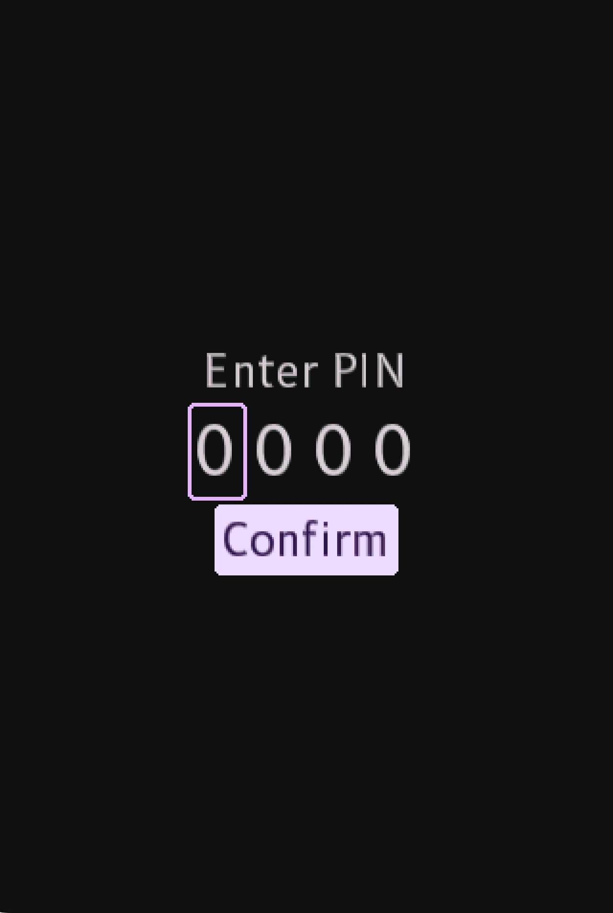
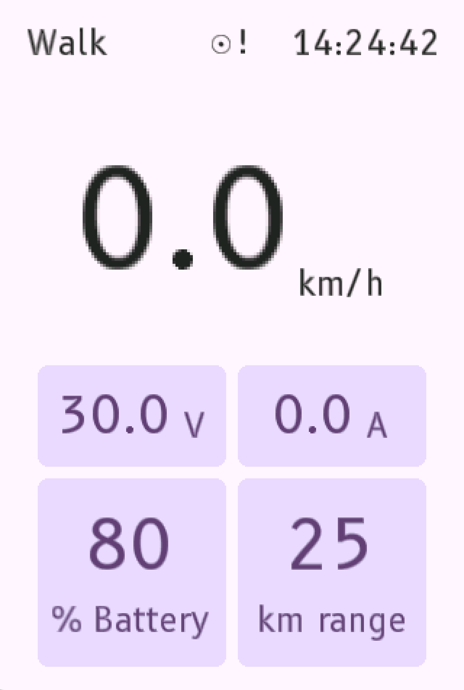
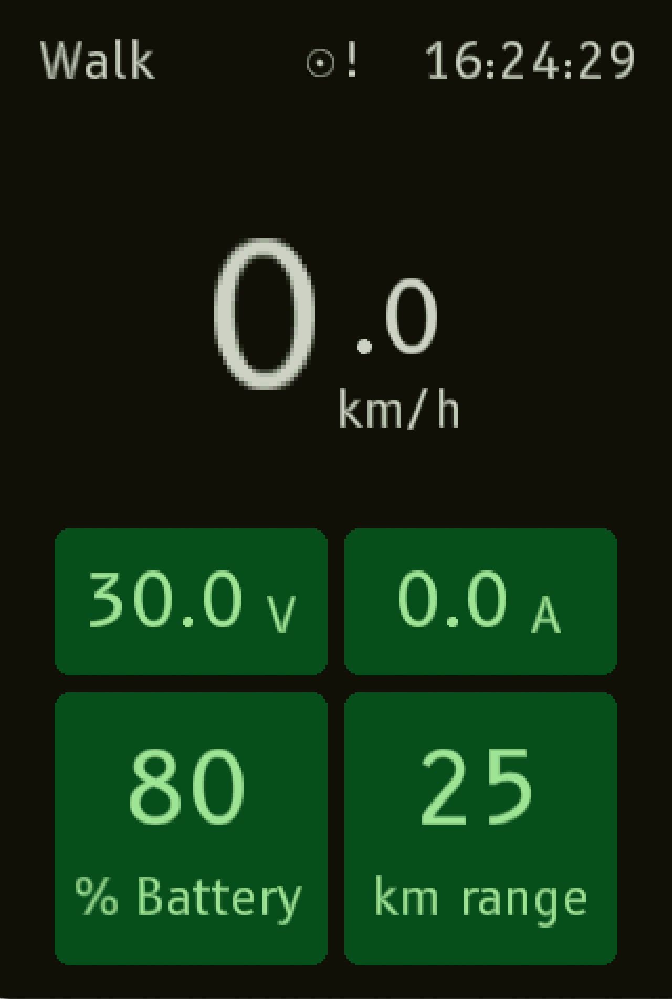
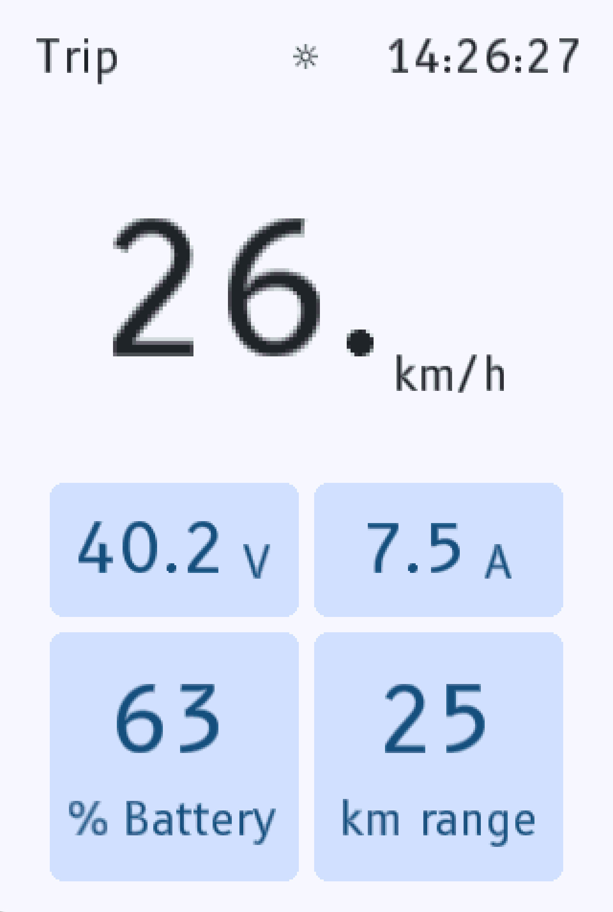

# Custom firmware for the Egret GT(S) display unit

This is some custom firmware which replaces the display unit firmware of the
Egret GT.

It's written in Rust and targets the AT32F415 microcontroller in the display unit.

    
    
    
    
    

### Features

- Nicer looking HUD (imo), primary colour of UI can be adjusted (at compile time).
- Can't skip unlock screen just by holding some buttons when powering on.
- Better range calculation (eventually)
- HUD shows battery voltage and current
- HUD shows current RTC time
- Speed limit control when using a GTS controller.
- Arbitrary speed limit (eventually) (done by limiting throttle)

### Flashing

The firmware can be built using `just binary` to produce a `firmware.bin` file.

This can then be copied to [simmsb/egret-can-flasher](https://github.com/simmsb/egret-can-flasher) to flash it.
